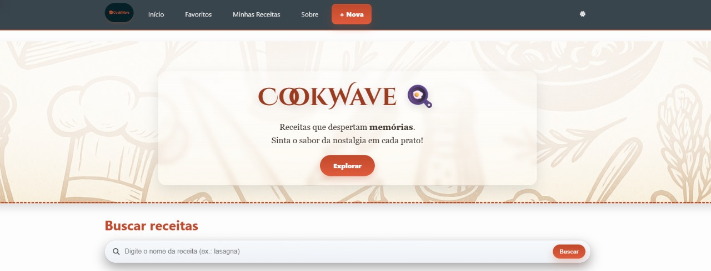
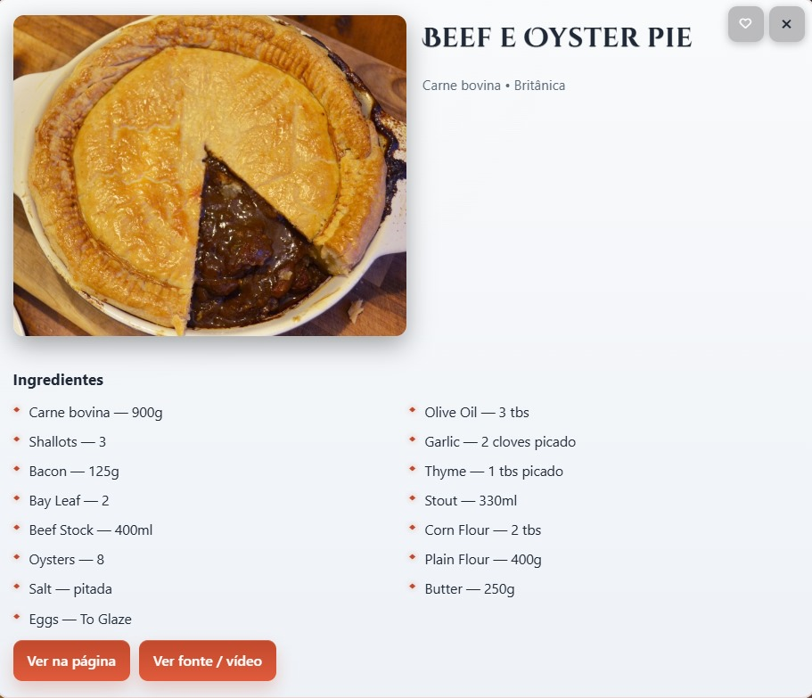
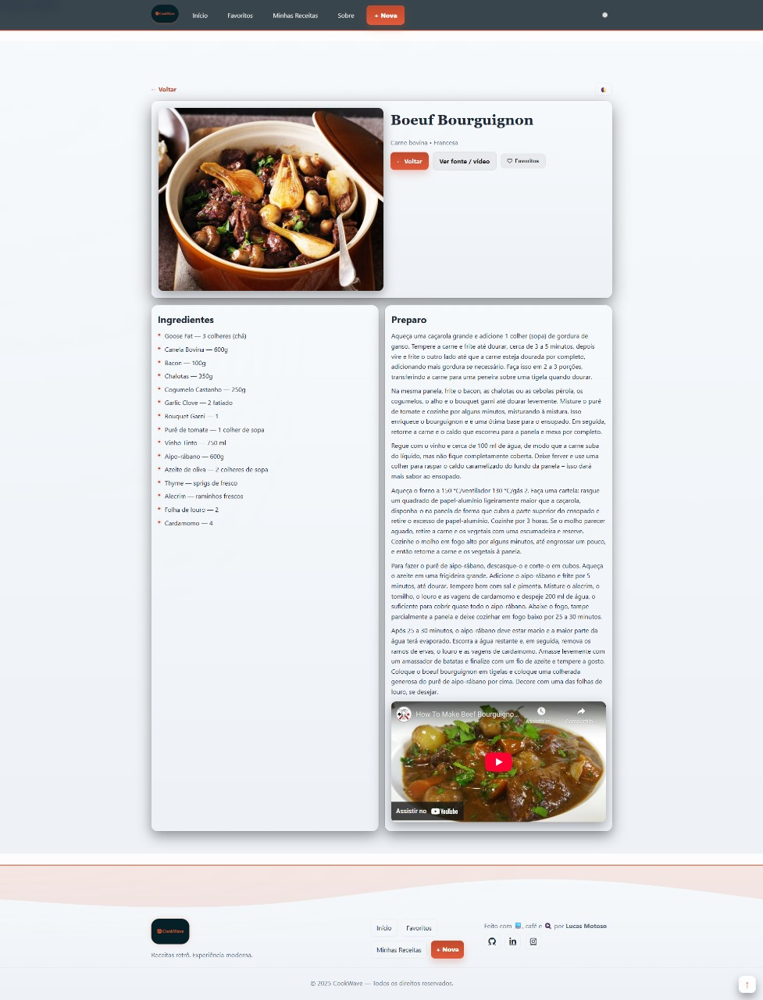

# CookWave 🍳  
**Receitas com vibe retrô — HTML + CSS + JavaScript + TheMealDB**

[](#)
[](#)
[](#deploy)
[](#acessibilidade)
[](#licença)

> **CookWave** é um webapp de receitas com estética **Tech/Retrowave**.  
> Usa a **API pública TheMealDB** para listar receitas aleatórias e por categoria, exibe **detalhes em modal** e **página dedicada**, possui **favoritos (localStorage)**, **modo claro/escuro** persistente, **busca** e páginas auxiliares (Sobre, Favoritos e Minhas Receitas).

---

## 📸 Preview


| Home (Grid + Busca) | Modal (Detalhes) | Página da Receita |
|---|---|---|
|  |  |  |

---

## ✨ Recursos

- **Receitas aleatórias e por categoria** (TheMealDB).
- **Busca** por nome (client-side) + filtros rápidos.
- **Modal dinâmico** com HTML incluído e controle por JS.
- **Página de detalhes** (`receita.html`) com imagem, ingredientes, preparo e vídeo (se disponível).
- **Favoritos** via `localStorage` (listagem em `favoritos.html`).
- **Minhas Receitas (locais)**: criação e armazenamento no dispositivo.
- **Dark/Light mode** com persistência; **header/footer** injetados via includes.
- **Back-to-Top** inteligente e **layout responsivo** (mobile-first).
- **Acessibilidade**: contraste adequado, foco visível e navegação por teclado.

---

## 🧩 Estrutura

```txt
cookwave/
├─ index.html
├─ receita.html
├─ favoritos.html
├─ minhas-receitas.html
├─ sobre.html
├─ assets/
│  ├─ img/ ...        (favicons, prévias, etc.)
│  └─ cv/  ...        (PDF do currículo)
├─ style/
│  ├─ main.css        (estilos base/landing)
│  ├─ header.css      (cabeçalho)
│  ├─ footer.css      (rodapé)
│  └─ about.css       (página Sobre / TechWave)
├─ scripts/
│  ├─ api.js               (TheMealDB: cards, busca, categorias)
│  ├─ modal.js             (carregamento + controle do modal)
│  ├─ recipe.js            (render da página de receita)
│  ├─ favorites.js         (helpers de favoritos)
│  ├─ favorites_page.js    (render da página de favoritos)
│  ├─ includes.js          (header/footer + tema + back-to-top)
│  └─ about.js             (lista repositórios no Sobre)
└─ README.md
